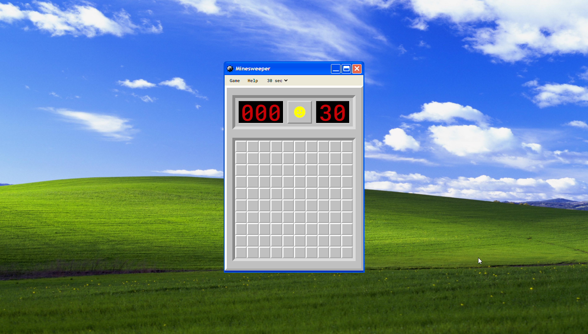

# Minesweeper / Campo Minato

## Description

Minesweeper is an iconic puzzle game that involves clearing a minefield without detonating any hidden mines. The objective is to uncover all the empty squares while avoiding the mines.

This is a Minesweeper application built using HTML, CSS, and plain JavaScript. 

## Features

- Difficulty: You can set the timer for the game making it more o less difficult.
- Timer: Track the time it takes to complete the game.
- Counter: Track every attempt you make to reach the victory.
- Responsive design: The app is optimized for various screen sizes and devices.

## Technology

  
 
  
  

## Demo

To see a live demo of the Minesweeper app, visit [Demo](https://www.massidev.com/portfolio/minesweeper/).

## Installation

To run the Minesweeper app locally, follow these steps:

1. Clone the repository: `git clone https://github.com/massi-17/minesweeper-app.git`
2. Navigate to the project directory: `cd minesweeper-app`
3. Open the `index.html` file in your preferred web browser.

## Usage
 
- Set the timer for your game.
- Click on a square to reveal its content.
- If the square contains a mine, the game ends.
- Complete the game by uncovering all non-mine squares and correctly flagging the mine locations.

## Contributing

Contributions are welcome! If you want to contribute to this Minesweeper app, please follow these steps:

1. Fork the repository.
2. Create a new branch: `git checkout -b feature/your-feature`.
3. Make your changes and commit them: `git commit -m 'Add your feature'`.
4. Push to the branch: `git push origin feature/your-feature`.
5. Submit a pull request.

